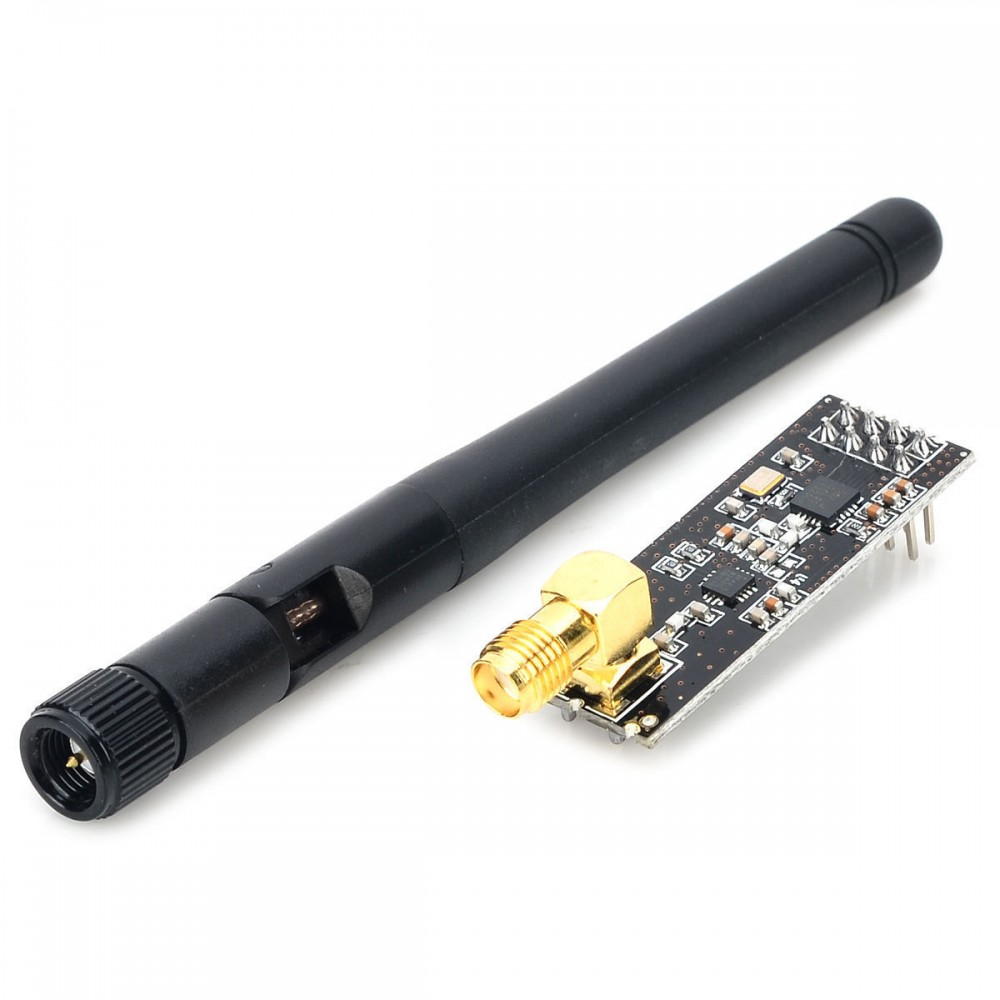

<h1 align="center">
   
  <a href="https://telemetry-iot.herokuapp.com/">AgroIot</a>
</h1>

Proyecto de una red de telemetría para el censado de variables ambientales (temperatura Aire, humedad Aire, temperatura Tierra, Humedad Tierra y Luz) dentro de un invernadero, con el fin de realizar un análisis de dichos datos, para que posteriormente sean guardados en la plataforma de servicios de la nube de [Firebase](https://firebase.google.com/), implementado los servicios de FireStore (Base de Datos) y Storage (Almacenamiento de contenido Multimedia). Esta información es presentada en una Aplicación Web llamada: [Telemetry Iot](https://telemetry-iot.herokuapp.com), este proyecto se encuentra en GitHub [TelemetryIot](https://github.com/potier97/TelemetryIot)

En este repositorio se explica cómo se estructura la red de Telemetría, los sensores utilizados, el funcionamiento básico de la red, el protocolo de comunicación implementado y los servicios creados.
 

## Resumen: 
  - [Estructura](https://github.com/potier97/AgroIot#estructura)
  - [Sensores](https://github.com/potier97/AgroIot#sensores)
  - [Funcionamiento](https://github.com/potier97/AgroIot#funcionamiento)
  - [Protocolo](https://github.com/potier97/AgroIot#protocolo)

La red de telemetría se encuentra ubicado en un Invernadero, del municipio de la Calera, Cundinamarca. Cuenta  con cinco nodos y un Gateway, estos se componen principalmente de:

##### Nodos
1. Microcontrolador [ESP8266](https://www.espressif.com/en/products/socs/esp8266) de Espressif
2. Transceptor [NRF24L01+](https://www.sparkfun.com/datasheets/Components/SMD/nRF24L01Pluss_Preliminary_Product_Specification_v1_0.pdf) de Nordic Semiconductor
3. Sensor de Temperatura y Humedad [DHT21](https://mikroshop.ch/pdf/DHT21.pdf)  (Temperatura Aire y Humedad Aire)
4. Sensor de Temperatura [DS18B20](https://datasheets.maximintegrated.com/en/ds/DS18B20.pdf)  (Temperatura Tierra)
5. Sensor DE Humedad del suelo [YL-69](https://saber.patagoniatec.com/2014/11/sensor-de-humedad-de-suelo-tierra-soil-moisture-arduino-yl-69-ptec/)   (Humedad Tierra)
6. Sensor de Luz [BH1750](https://www.mouser.com/datasheet/2/348/bh1750fvi-e-186247.pdf)  (Luz Ambiente)

##### Gateway
1. Raspberry pi 3
2. Transceptor [NRF24L01+](https://www.sparkfun.com/datasheets/Components/SMD/nRF24L01Pluss_Preliminary_Product_Specification_v1_0.pdf) de Nordic Semiconductor
 

##Estructura

La dimensión del invernadero es de 6m x 5.6m, así que la distribución y ubicación de los nodos se realiza de acuerdo con la siguiente imagen:

<h4 align="center">
   
  <a >Ubicación de Nodos</a>
</h4>

Las coordenadas de cada nodo en el invernadero son:

| Nodo | Coordenada |
| ------ | ------ |
| Nodo Uno | (5.8m, 2m) |
| Nodo Dos | (0.1m, 1.4m) |
| Nodo Tres | (3m, 2.3m) |
| Nodo Cuatro | (5.1m, 5.1m) |
| Nodo Cinco | (0.1m, 5.1m) | 

El Gateway no se encuentra ubicado en el invernado, pero está ubicado aproximadamente 12 metros, respecto al invernadero.

<h4 align="center">
   
  <a >Gateway</a>
</h4>

Los nodos funcionan mediante la alimentación de baterías y/o de la red eléctrica. El despliegue de estos se realiza de acuerdo a las coordenadas dadas. La estructura de cada nodo es a partir de PVC y cajas IP 55, tienen una altura de aproximadamente 1.1m 

<h4 align="center">
   
  <a >Instalación de Nodos</a>
</h4>

Cada nodo se entierra a 35cm, esto con el fin de evitar que la estructura caiga, y los sensores del suelo puedan estar cubiertos, todos los censores del suelo (Temperatura Tierra, Humedad Tierra) están enterrados a 5 cm.

## Sensores
Como se mencionó al principio, los sensores implementados en cada nodo son:  
 
1. Sensor de Temperatura y Humedad [DHT21](https://mikroshop.ch/pdf/DHT21.pdf)  (Temperatura Aire y Humedad Aire)
2. Sensor de Temperatura [DS18B20](https://datasheets.maximintegrated.com/en/ds/DS18B20.pdf)  (Temperatura Tierra)
3. Sensor DE Humedad del suelo [YL69](https://saber.patagoniatec.com/2014/11/sensor-de-humedad-de-suelo-tierra-soil-moisture-arduino-yl-69-ptec/)   (Humedad Tierra)
4. Sensor de Luz [BH1750](https://www.mouser.com/datasheet/2/348/bh1750fvi-e-186247.pdf)  (Luz Ambiente)

##### DHT21
Este sensor, también es conocido como: AM2301, y cuenta con las siguientes características:

| Característica | Valor |
| ------ | ------ |
| Alimentación | 3.3v - 5.5v |
| Corriente | 1mA - 1.5mA |
| Rango Medición | -40°C - 80°C |
| Resolución | 16 Bits |
| Precisión | ±0.5°C | 

La biblioteca de DHT21 para ser programado en Arduino, se encuentra en:  [https://github.com/adafruit/DHT-sensor-library](https://github.com/adafruit/DHT-sensor-library)

##### DS18B20
Este sensor, de tipo sonda antifluido, cuenta con las siguientes características:

| Característica | Valor |
| ------ | ------ |
| Alimentación | 3.3v - 5.5v |
| Corriente | < 60uA |
| Rango Medición | -55°C - 125°C |
| Resolución | 9 Bits - 12 Bits |
| Precisión | ±0.5°C | 

La biblioteca de DS18B20 para ser programado en Arduino, se encuentra en: [https://github.com/matmunk/DS18B20](https://github.com/matmunk/DS18B20)

##### YL-69
Este sensor es análogo para la medición de la humedad, por lo tanto, es necesaria su caracterización, para ello puede revisar el siguiente [link](https://www.youtube.com/watch?v=iWV42viyLtQ&ab_channel=Electgpl). Este sensor cuenta con las siguientes características:

| Característica | Valor |
| ------ | ------ |
| Alimentación | 3.3v - 5v |
| Voltaje Salida | 0v - 4.2v |
| Corriente | < 35mA |
| Salida de Medición | Análoga  y Digital| 
| Salida Digital | Ajustar el nivel de tensión  | 
 
Este módulo no necesita de una biblioteca para ser utilizado

##### BH1750
Cuenta con las siguientes características:

| Característica | Valor |
| ------ | ------ |
| Alimentación | 2.4v - 3.6v |
| Corriente | 7mA |
| Rango Medición | 0.11 Lux - 100000 Lux |
| Resolución | 16 Bits |

La biblioteca de BH1750 para ser programado en Arduino, se encuentra en: [https://github.com/claws/BH1750](https://github.com/claws/BH1750)

## Funcionamiento

El funcionamiento básico de la red de telemetría consiste en la ejecución repetitiva de dos servicios, el primer servicio trata que, en cada uno de los nodos se debe de realizar el censado de cada variable ambiental, empaquetarlo  y enviarlo al Gateway quien recibe y guardar los datos, para luego dormir el nodo por 30 minutos y volver a iniciar el proceso; El segundo servicio se centra en el Gateway, este cada hora, valida si existen nuevos datos registrados, para  luego, organizarlos, promediarlos, analizarlos creando mapas de calor según los datos de cada variable y enviarlos a la nube, en donde esta información se encontrará estructurada. De acuerdo con lo anterior, se debe resaltar que:

- El código de los nodos se programó mediante el IDE de Arduino.
- Siempre se ejecutan dos Scripts (Servicios) en el Gateway, estos corresponden a: recibir los paquetes de datos censados de los nodos, y de analizar y enviar la información a la nube.
- Los servicios generados se realizan mediante [Systemd](https://www.raspberrypi.org/documentation/linux/usage/systemd.md), los cuales siempre se están ejecutando y se inician si se reinicia o enciende la Raspberry
- El servicio de la comunicación con la red de Telemetría se programó en C++
- El servicio del análisis y envió de información a la nube se programó en Python

Así mismo, se explica la lógica de programación de cada servicio y nodo del proyecto
1  [Scripts de Arduino - Thing](https://github.com/potier97/AgroIot/tree/master/arduino)
2  [Servicio - Comunicación con la red de telemetría](https://github.com/potier97/AgroIot/tree/master/rf24)
3  [Servicio - Envío de información a la nube](https://github.com/potier97/AgroIot/tree/master/service)
 

## Protocolo

<h4 align="center">
   
  <a>Transceptor NRF24L01+</a>
</h4>

 Este proyecto utiliza los Transceptores  [NRF24L01+](https://www.sparkfun.com/datasheets/Components/SMD/nRF24L01Pluss_Preliminary_Product_Specification_v1_0.pdf) de Nordic Semiconductor, y se trabaja con el protocolo de comunicación de dicho transceptor, para el desarrollo del proyecto se trabaja con la librería [RF24Network](https://github.com/nRF24/RF24Network) de  [TMRh20](https://github.com/TMRh20), para mayor información del funcionamiento básico del transceptor puede revisar en los siguiente enlaces:
 
  - [How nRF24L01+ Wireless Module Works](https://lastminuteengineers.com/nrf24l01-arduino-wireless-communication/)
  - [Newly Optimized RF24Network Layer 2020](http://tmrh20.github.io/RF24Network/)
  - [Newly Optimized RF24Network Layer 2020](https://howtomechatronics.com/tutorials/arduino/how-to-build-an-arduino-wireless-network-with-multiple-nrf24l01-modules/)
  - [COMUNICACIÓN INALÁMBRICA A 2.4GHZ CON ARDUINO Y NRF24L01](https://www.luisllamas.es/comunicacion-inalambrica-a-2-4ghz-con-arduino-y-nrf24l01/)
  - [Tutorial básico NRF24L01 con  Arduino](https://naylampmechatronics.com/blog/16_Tutorial-b%C3%A1sico-NRF24L01-con-Arduino.html)

License
----
AgroIot tiene la licencia [MIT](https://github.com/potier97/AgroIot/license)

